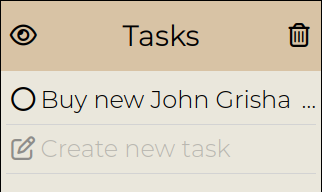
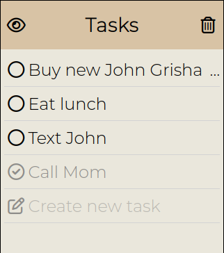
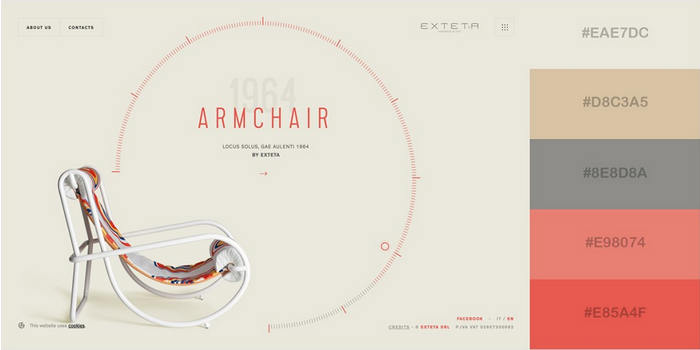

# Design Ideas

### How to check off task

1. checkbox on left - most important part of task list is checking off tasks when complete, therefore, place on far left 
   
   

   1. checking off moves task to bottom of list - put less relevant information further from the top left

   

   2. lighten text when finished to further emphasize completed tasks are less relevant
2. swipe - similar to checking off item on physical list

### How to edit task

1. tap on task name to edit

### Add new task

1. below last task is new task button - uses pen on paper icon to to indicate new task - emphasizes connection to real world task list where tasks are written on paper

   

2. always visible create new task button at bottom of screen

### Show uncompleted tasks

1. toggle button above first item in list - selecting toggle will show only uncompleted

### Delete all completed tasks

1. toggle button next to "uncompleted tasks button" that deletes all completed tasks

### Color palette
We chose to use color palette 19 because the eggshell evokes trustworthiness and practicality. The color is also reminiscent of traditional notepads, making the task list feel like the user is writing down a task on paper.

