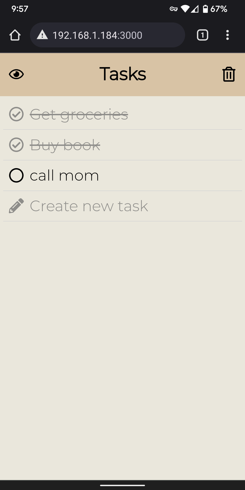
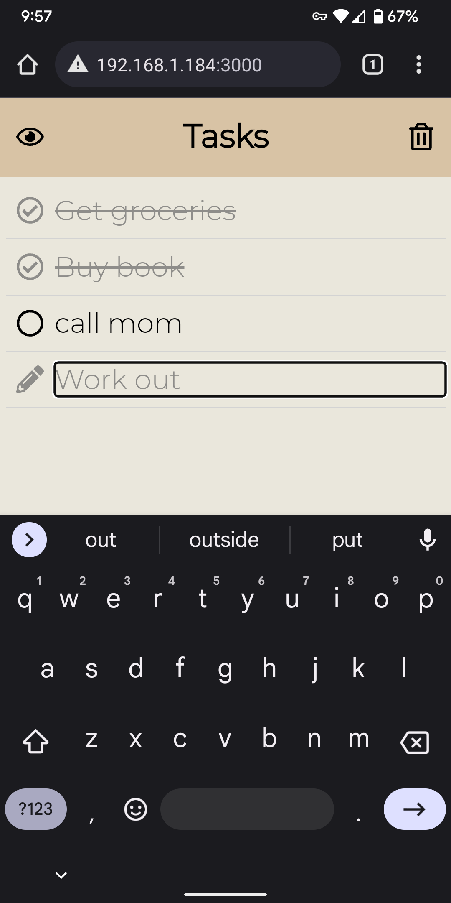
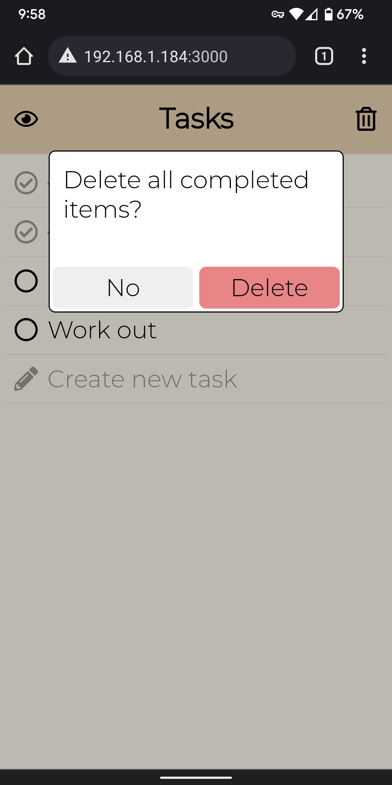
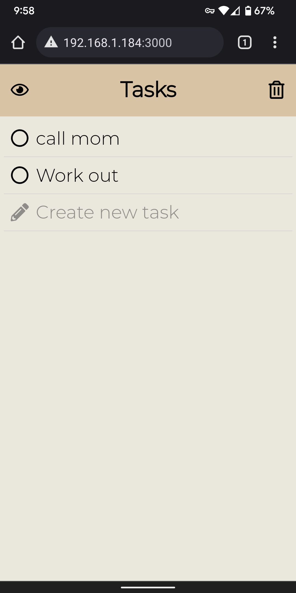

## Design decisions

### Color palette and font

In our initial discussions, some adjectives we used to describe our desired app design were "attentive", "stable", and "assertive". With this in mind, we decided on a color palette from the exercise following Dr. Milburn's lecture labeled "minimal yet warm" (number 19 on [this list](http://visme.co/blog/website-color-schemes)), which includes a pale eggshell (\#EAE7DC), a warm grey (\#8E8D8A), and a rustic tan (\#D8C3A5). We also chose the sans serif font Montserrat as we felt it reflected the desired adjectives as well.

Before creating a new task:

While typing in new task:

After unfocusing new task input:

In the picture above, we used eggshell for the background, tan for the header, and grey for the new task text.

### Header

We leveraged the common design metaphor of a header on a mobile application; though the header is the first item on the screen, it is understood that the main content of the page is below in the main container. We have actions listed in the header (showing/hiding or deleting completed items) along with the title/name of "Tasks".

### Icons

To indicate the possible actions of our app, we used icons from Font Awesome. The specific icons used were `circle`, `circle-check`, `pen-to-square` `eye`, `eye-slash`, `trash-can`. While we didn't think all of these were perfect icons (for example, `pen-to-square` could have been a simple plus sign or just a pen), we believed these were the best free options available to us.

### Delete Confirmation

We figured it would be best to include a warning modal to make sure users dont accidentally delete all completed items by tapping the trash button. So, when the trash icon is pressed, a warning box comes up at the bottom asking if the user is sure they want to delete all completed items.

Delete confirmation pop-up:

After confirming delete:

## Alternate designs

We considered a few other color palettes (numbers 37 and 50) and some other fonts, but these design decisions were surprisingly easy. There was some more discussion about alternate designs for the overall format of the app. How do we allow the user to create a new task: is it another element in the list or a floating button at the bottom of the screen? Where should we place the buttons to manage completed items: at the top of the list (so scrolling down removes them from display), or floating, or in the header? 

## User Testing

We had 3 people test our app, none of whom have taken this class, or have notable design experience. All three said they enjoyed their experience and felt that the app was simple and intuitive. They did ask if the color of the header could be different, and we changed it to a slightly more orange hue. However, upon doing this, the new color did not look as good to almost everyone, and so we changed it back.

## Final Design

Clicking Eye Icon:

## Challenges

### Technical issues

While most of the development was smooth, we had some trouble correctly including the new font Montserrat and our icon package Font Awesome. We also struggled with aligning the text and icons together correctly.

### Icons

As stated above, we spent some time debating how to best represent the actions a user in our app could take. With a limited screen size, we didn't want to use lots of text as that could potentially distract from the main point of the application - making a list of tasks. We decided that icons could be useful, and then had to decide what icon package and which icons to use.

### Header design

We weren't sure initially how to fit two buttons into the header with the constraint of our screen size: we wanted the buttons for showing only uncompleted items and deleting all completed items to be visible no matter the user's position on the list (if they've scrolled down), but the header was not very wide. Fortunately, placing two icons with normal text size in the header didn't feel too cramped. 

## Favorite parts

We really think the color palette and font both capture our intent with this design; it's calm yet practical, reassuring, and even reminiscent of a traditional notepad. We also think the feature of the new task being blurred after we press enter on the task item. Task lists can certainly be imposing and urgent, aggressively reminding the user of things they need to do immediately, but we wanted ours to be more relaxed and controlled.
